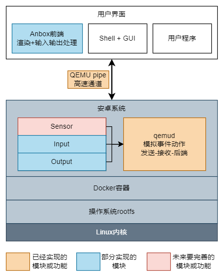

### 方案设计
### 1.方案设计  

图1 基于Linux系统运行Android 11的解决方案架构图

&ensp;&ensp;&ensp;&ensp;此项目基于原有Anbox方案进行**更新及改进**。我们**改进**使用基于Docker容器技术提供隔离的、与Linux并行运行的安卓环境，此种改进是对于原有LXC容器的**平替**，但其重新适配与调试仍然需要大量移植与测试的工作量才能保证其维持原有稳定性，并更好地利用更多的新特性开发新的功能。除此之外我们**更新**了原有Android 7，移植新的Android 11，此过程需要重新移植适配原有Anbox的各个组件适配新安卓上的HIDL接口，同时需要修改安卓底层让其能正常运行在Docker上，此过程仍需要大量的移植于测试的工作量。此项目仍然利用Anbox已实现好并趋于完善的部分功能，在Linux下上层APP实现与安卓底层对接输入输出和OpenGL ES的渲染等实现。这些设计目标在于使用Docker**替代**原有Anbox使用的较旧的LXC容器技术，并**更新**其Android 7到Android 11，其中技术革新点如下：  

1. 使用更新的Android 11替代原有老旧的Android 7。  
2. Android 11中的HAL层使用了HIDL接口这一新的Treble的架构，更加规范及更高的可移植性。  
3. 使用生态丰富、快速部署、可移植、更加可控的Docker作为底层容器运行环境替代原有集成LXC这一高耦合、低可移植性的实现方式。  
4. 活用成熟的Anbox部分对多平台高兼容性的实现方式，以应对目前国产系统多种硬件平台和系统环境的问题。  

##### 在以上的设计方案下，我们针对其各个部分进行详细设计  
1. 底层部分：Docker下的安卓11容器设计：  

图2 Bitcomet实现底层部分设计框架图

• **高可移植设计**：使用了Docker便集成了Docker相关的优点，Docker相比原有LXC有可移植性、版本控制、回滚、快速部署等优点，同时原有LXC容器与Anbox进行了高度集成，在目前多平台和可移植性考量下，原有Anbox的系统镜像与各个配置选项都不能方便地进行更改将会导致我们适配到国产系统中遇到重重困难。  
• **快速迭代更新**：我们选择了Docker提供底层容器运行环境，利用其快速部署的优点，可以使Android 11更加灵活地运行在目标平台。  
• **优雅的数据管理**：利用Docker的版本控制和回滚特性，设计恢复出厂设置并清空用户数据的功能，并为以后Android镜像更新时能够快速部署，及时把新版本推送。  
• **较高系统安全性**：把安卓放在密封的容器当中，其外部访问数据都通过QEMU pipe交给上层Anbox前端应用接管，其应用也只有基本的输入输出功能，安全性较高。  
• **极低的运行损耗**：通过容器直接基于现有系统Linux内核运行，并基于Linux内核特性进行容器隔离，这一方案提高了稳定性并降低了运行损耗。  
  
2. 中间层：安卓中运行qemud提供QEMU pipe这一高速管道与上层通信：  

图3 Bitcomet中间层部分设计原理图

• **成熟的通信方案**：这一通信方案基于成熟的Anbox的通信这一部分的功能实现，其底层由qemud提供接口，由安卓和Anbox两端利用相应API把接口打开进行通信，其实现方案最早可以追溯到2013年的谷歌Goldfish的Android模拟器实现并且沿用至今，其实现了Android与Linux的之间通信的兼容性与健壮性并存的实现方式。  
• **便捷的交互方式**：我们安卓与Linux之间的通信方案设计基于QEMU pipe这一高速通道，直接在Android与Linux之间打通一个灵活的通信渠道，我们不用考虑我们需要的具体通信实现，直接在安卓HAL层服务和上层Anbox前端应用中打开相应通道进行安卓与Linux对接的数据通信。  
  
3. 上层部分：Anbox通过QEMU pipe与底层通信，接收安卓的渲染信息渲染以及音频在上层APP输出，把上层前端APP的输入和状态传递给安卓。  

图4 Bitcomet上层部分设计原理图

• **兼容性高**：主要体现在Linux下对Anbox的兼容性，这一方案的设计把安卓需要与Linux交互和获取的数据都通过QEMU pipe传输给Linux处理，上层Anbox前端不依赖硬件。尤其是渲染也是调用系统现有OpenGL库实现，兼容性相比虚拟机来说更高。  
• **易用性高**：通过上层Anbox应用接管底层安卓的输入输出等部分，相当于把安卓应用直接映射给了Linux应用。这一操作安卓应用非常接近使用Linux应用的方式，极大的提高了其易用性，操作起来也更加简单。  

