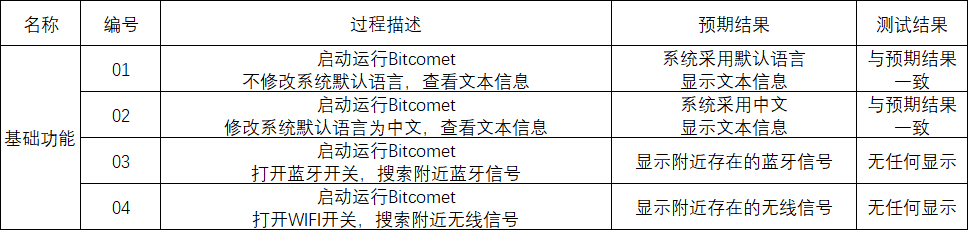

# 3. Bitcomet实验测试

&nbsp;&nbsp;&nbsp;&nbsp;&nbsp;&nbsp;&nbsp;&nbsp;由于Bitcomet是一款基于Anbox方案进行移植，实现Android 11系统在Linux平台上运行的产品，其相关资料缺乏，因此市面上并没有针对此类产品进行测试的工具，我们利用了市场上主流的Android基准测试应用，选取安兔兔AI以及Geekbench4.0两款评估APP对Bitcomet进行性能评估测试，这样能简洁有效地衡量bitcomet运行安卓的效率。同时为了对比Bitcomet的性能优势，同时选用市场占有率较高的Genymotion模拟器进行同步测试。Genymotion是一款优秀专业高性能的安卓Android模拟器，它同时支持 Windows、Mac以及Linux平台，其模拟运行速度优秀，画面流畅、且支持模拟器多开、全屏等特性，充分经过了市场的认证，在模拟器领域占有一席之地。因此本次实验将Genymotion作为Bitcomet的性能参照及对比对象。

&nbsp;&nbsp;&nbsp;&nbsp;&nbsp;&nbsp;&nbsp;&nbsp;本次测试的基本思路为：首先，测试Bitcomet的系统运行功能，确保其能够实现Android系统的正常开启及进入系统界面。其次，测试系统各项主要功能是否正常，主要分为三个内容：其一，测试基础信息是否正常显示；其二，测试基础功能是否正常运行；其三，测试基础应用是否能够正常运行，以及是否支持第三方应用安装与运行。再者，测试Bitcomet内运行Android的CPU工作效率，对比模拟器是否有CPU利用效率上的差距。最后，测试Bitcomet对于内存开销的情况，对比模拟器是否有内存占用较低的优势。

## 1. 实验准备

### 1.1 环境准备

&nbsp;&nbsp;&nbsp;&nbsp; &nbsp;&nbsp;&nbsp;&nbsp;本次测试环境硬件参数如下表所示。

表1.1 环境硬件参数

### 1.2 实验策略

&nbsp;&nbsp;&nbsp;&nbsp;&nbsp;&nbsp;&nbsp;&nbsp;Genymotion与Bitcomet两者的实现架构有所不同，前者采用市面上目前大多数模拟器产品都在使用的虚拟化实现方案，而后者则创新性地使用了Dokcer以提供安卓运行的环境的方案。

&nbsp;&nbsp;&nbsp;&nbsp;&nbsp;&nbsp;&nbsp;&nbsp;为了测试Bitcomet功能完整性以及展现其性能优异的特点，同时为了保证测试的公平性以及方便后续的调试与开发，本次测试统一环境，采用物理机搭配Ubuntu20.04系统方案作为测试环境。

&nbsp;&nbsp;&nbsp;&nbsp;&nbsp;&nbsp;&nbsp;&nbsp;根据前文所讲述的测试思路，本次测试制定如下测试策略。

 #### 1.2.1 系统运行测试

 &nbsp;&nbsp;&nbsp;&nbsp;&nbsp;&nbsp;&nbsp;&nbsp;系统运行测试主要是测试系统从镜像下载到环境搭建以及最终运行的一系列步骤，测试其最终是否能正常启动。总结系统运行测试的基本步骤为：  
  &nbsp;&nbsp;&nbsp;&nbsp;&nbsp;&nbsp;&nbsp;&nbsp;(1) 下载测试镜像。  
  &nbsp;&nbsp;&nbsp;&nbsp;&nbsp;&nbsp;&nbsp;&nbsp;(2) 安装Docker环境，并加载内核模块和挂载binder文件系统。  
  &nbsp;&nbsp;&nbsp;&nbsp;&nbsp;&nbsp;&nbsp;&nbsp;(3) 启动Bitcomet并进入Android shell模式。  
  &nbsp;&nbsp;&nbsp;&nbsp;&nbsp;&nbsp;&nbsp;&nbsp;(4) 执行logcat查看启动日志。  
  &nbsp;&nbsp;&nbsp;&nbsp;&nbsp;&nbsp;&nbsp;&nbsp;(5) 利用QtScrcpy投屏软件连接Bitcomet显示Android界面。  

 #### 1.2.2 系统功能测试

 &nbsp;&nbsp;&nbsp;&nbsp;&nbsp;&nbsp;&nbsp;&nbsp;系统功能测试是验证Bitcomet在Linux下容器启动方案的重要部分。主要是验证Bitcomet基本功能使用和应用程序的运行情况。系统功能测试主要分为三个测试内容：  
 &nbsp;&nbsp;&nbsp;&nbsp;&nbsp;&nbsp;&nbsp;&nbsp;(1) 基础信息测试，测试其是否能够显示设定的设备名称与型号。  
 &nbsp;&nbsp;&nbsp;&nbsp;&nbsp;&nbsp;&nbsp;&nbsp;(2) 基础功能测试，测试其是否能修改系统默认语言。  
 &nbsp;&nbsp;&nbsp;&nbsp;&nbsp;&nbsp;&nbsp;&nbsp;(3) 基础应用测试，测试其通信录，闹钟，浏览器等系统自带应用以及第三方应用是否能够正常使用。  

 #### 1.2.3 CPU性能测试

  &nbsp;&nbsp;&nbsp;&nbsp;&nbsp;&nbsp;&nbsp;&nbsp;本次测试采用统一环境，该项测试结果可认为是两种方案运行Android系统其CPU利用效率的对比。本次测试利用安兔兔AI评测App以及GeekBench App进行CPU性能评估。其中安兔兔AI评测主要是针对CPU中的AI运算能力进行针对性分析，其使用目前主流的Inception v3和MobileNet-SSD两种神经网络模型，进行Image Classification和Object Detection两项关键测试，基于准确率和速度等指标，对设备的AI运算能力进行综合评估。而Geekbench是一个跨平台基准测试工具，可以同时应用于多种平台之上例如windows、Android以及IOS，其重点考察CPU的运算能力。遂CPU测试主要分为三个测试内容：  
  &nbsp;&nbsp;&nbsp;&nbsp;&nbsp;&nbsp;&nbsp;&nbsp;(1) 利用安兔兔AI App对Bitcomet以及Genymotion进行Image Classification测试。  
  &nbsp;&nbsp;&nbsp;&nbsp;&nbsp;&nbsp;&nbsp;&nbsp;(2) 利用安兔兔AI App对Bitcomet以及Genymotion进行Object Detection测试。  
  &nbsp;&nbsp;&nbsp;&nbsp;&nbsp;&nbsp;&nbsp;&nbsp;(3) 利用Geekbench App对Bitcomet以及Genymotion进行CPU运算能力测试。  

 #### 1.2.4 内存开销测试

  &nbsp;&nbsp;&nbsp;&nbsp;&nbsp;&nbsp;&nbsp;&nbsp;本次测试还对Bitcomet与Genymotion运行时内存开销情况进行对比，分别测试仅运行Genymotion模拟器启动Android系统和仅运行Bitcomet启动Android系统情况下的内存开销情况。总结内存开销测试步骤为：  
  &nbsp;&nbsp;&nbsp;&nbsp;&nbsp;&nbsp;&nbsp;&nbsp;(1) 仅运行Genymotion， 启动Android系统。  
  &nbsp;&nbsp;&nbsp;&nbsp;&nbsp;&nbsp;&nbsp;&nbsp;(2) 记录内存开销情况。  
  &nbsp;&nbsp;&nbsp;&nbsp;&nbsp;&nbsp;&nbsp;&nbsp;(3) 仅运行Bitcomet，启动Android系统。  
  &nbsp;&nbsp;&nbsp;&nbsp;&nbsp;&nbsp;&nbsp;&nbsp;(4) 记录内存开销情况。  

## 2. 实验结果及分析

 ### 2.1 系统运行测试结果及分析

  &nbsp;&nbsp;&nbsp;&nbsp;&nbsp;&nbsp;&nbsp;&nbsp;根据测试步骤，下载测试镜像，安装环境并加载启动Bitcomet所需模块后，Bitcomet可成功启动，通过相关命令可以进入Android shell模式，QtScrcpy投屏软件可以连接Bitcomet并显示Android界面。系统成功启动，运行正常。  

 ### 2.2 系统功能测试结果及分析

  &nbsp;&nbsp;&nbsp;&nbsp;&nbsp;&nbsp;&nbsp;&nbsp;根据测试内容，本次测试为系统功能测试设计如下测试用例：  

表2.1 基础信息测试用例

  &nbsp;&nbsp;&nbsp;&nbsp;&nbsp;&nbsp;&nbsp;&nbsp;在基础信息测试中，各测试用例所得结果均与预期结果一致，设备名称与型号可根据用户设定显示，基础信息测试全部正常。

表2.2 基础功能测试用例

  &nbsp;&nbsp;&nbsp;&nbsp;&nbsp;&nbsp;&nbsp;&nbsp;在基础功能测试中，系统语言可根据用户定义显示，蓝牙，WIFI功能无法正常使用，基础功能测试部分正常。

表2.3 基础应用测试用例

  &nbsp;&nbsp;&nbsp;&nbsp;&nbsp;&nbsp;&nbsp;&nbsp;在基础应用测试中，各测试用例所得结果均与预期结果一致，通讯录、闹铃、浏览器等系统App以及第三方App均可正常使用，基础应用测试全部正常。

 ### 2.3 CPU性能测试结果及分析

  &nbsp;&nbsp;&nbsp;&nbsp;&nbsp;&nbsp;&nbsp;&nbsp;为了方便观察，同时两个app主要展示CPU性能效率的不同，所以本节实验将Bitcomet与Genymotion利用安兔兔AI App进行Image Classification和Object Detection两项关键测试与Geekbench App对CPU进行单核与多核测试结果进行集中对比分析，其结果如图2.1、2.2所示。

  
图2.1 安兔兔AI测试得分对比图

  
图2.2 Geekbench测试得分对比图

  &nbsp;&nbsp;&nbsp;&nbsp;&nbsp;&nbsp;&nbsp;&nbsp;在本次测试中，因Genymotion与Bitcomet所依赖硬件环境相同，故两者最终分数即为对CPU利用效率的评分。

  &nbsp;&nbsp;&nbsp;&nbsp;&nbsp;&nbsp;&nbsp;&nbsp;从图2.1中可以看出Bitcomet最终得分相较于Genymotion有显著提升。相比Genymotion模拟器，Bitcomet的总分高出约22%，主要体现在Image Classification-Speed和Object Detection-Speed上。说明在AI算力上面Bitcomet对比Genymotion表现不俗。

  &nbsp;&nbsp;&nbsp;&nbsp;&nbsp;&nbsp;&nbsp;&nbsp;在Geekbench测试中，Bitcomet多核得分高出Genymotion得分约14%。比较CPU时，在Android移动端设备上，14%的性能提升相当于当今移动端旗舰级芯片高通骁龙865和高通骁龙888的性能差距(数据来自：移动芯片性能排行榜，链接:www.socpk.com)，也就是芯片厂商用一年时间更迭优化出的性能。

  &nbsp;&nbsp;&nbsp;&nbsp;&nbsp;&nbsp;&nbsp;&nbsp;两个测试都证明了Bitcomet在CPU的利用效率上对比模拟器具有显著优势。CPU是每一台计算机的运算和控制核心，无论是Android手机还是平板甚至是家里的智能微波炉，都可以算是一台计算机。CPU在Android应用上面尤为重要，因为在用户除了游戏之外的方方面面都扮演了重要的角色。无论是打开一个视频进行观看，需要CPU的解码器进行视频解码，还是点开网页进行浏览，都需要CPU的身影。特别是日常办公场景下，CPU的作用和需求无疑是比GPU大。所以Bitcomet在CPU的利用效率上的显著优势在办公场景就会更加明显突出。

  &nbsp;&nbsp;&nbsp;&nbsp;&nbsp;&nbsp;&nbsp;&nbsp;Bitcomet在CPU利用效率方面相比较Genymotion有如此大的提升，其主要原因是在于Genymotion采用的是虚拟化技术，而虚拟化是在硬件层之上进行了封装，相比于Bitcomet采用的基于容器技术，虚拟化技术必然会损失一部分硬件性能。

 ### 2.4 内存开销测试结果及分析

  &nbsp;&nbsp;&nbsp;&nbsp;&nbsp;&nbsp;&nbsp;&nbsp;本次还对两者运行时内存开销情况进行对比分析，分别测试仅打开Genymotion启动Android系统和仅打开Bitcomet启动Android系统，不运行任何其他应用程序，记录其内存的开销情况，具体情况如图2.3所示。

  
图2.3 内存开销情况对比图

  &nbsp;&nbsp;&nbsp;&nbsp;&nbsp;&nbsp;&nbsp;&nbsp;从图2.3中可以看出，在同等情况下，Bitcomet在内存占用方面远低于Genymotion。Bitcomet在内存开销上的优势使得在相同硬件条件下，Bitcomet可实现比Genymotion更加多的后台App留存率，这对用 户的体验至关重要。我们使用Android系统时，经常在看视频的时候会回微信消息，这就要求我们在开启 视频应用在前台运行的同时，后台程序微信必须有足够的内存空间让其在后台保持运行，如果内存不足的话用户就可能在看视频，玩游戏的时候错过重要的消息通知。内存占用率的优势可以显著提高用户体验。

  &nbsp;&nbsp;&nbsp;&nbsp;&nbsp;&nbsp;&nbsp;&nbsp;Bitcomet采用基于容器技术，不同于普通的模拟器需要执行完整的硬件资源虚拟化，更有着更少的抽象层，所以在内存占用的优势上面会比虚拟机大。

## 3. 测试总结

&nbsp;&nbsp;&nbsp;&nbsp;&nbsp;&nbsp;&nbsp;&nbsp;在系统运行测试，系统功能测试部分，Bitcomet已成功在Ubuntu20.04下运行。除部分功能未完善外，通讯录，闹铃，浏览器等基础应用及系统基础信息均可正常使用与显示，也可根据需求安装第三方软件。

&nbsp;&nbsp;&nbsp;&nbsp;&nbsp;&nbsp;&nbsp;&nbsp;通过Bitcomet与Genymotion在CPU性能测试与内存开销测试的情况对比可知，Bitcomet无论是在CPU利用效率还是内存开销上都优于Genymotion，这说明即便是在硬件性能较低的机器上，Bitcomet性能表现也可超越市场上同类型模拟器。当然不仅仅是应用于性能较低的机器上。更多的在虚拟化的场景下，规模越大，15%性能提升带来的经济性就会越明显。以十作为单位的这个数量等级上，可能我们15%的性能提升可以少买两台机子达到同样的性能，但是虚拟化更多的时以百，以千做单位。在虚拟化领域每一度电都要“斤斤计较”现状下，15%的提升显然是不可忽视的。
