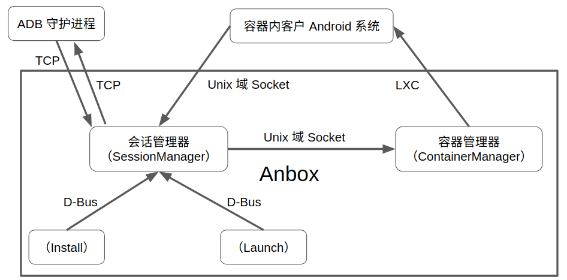
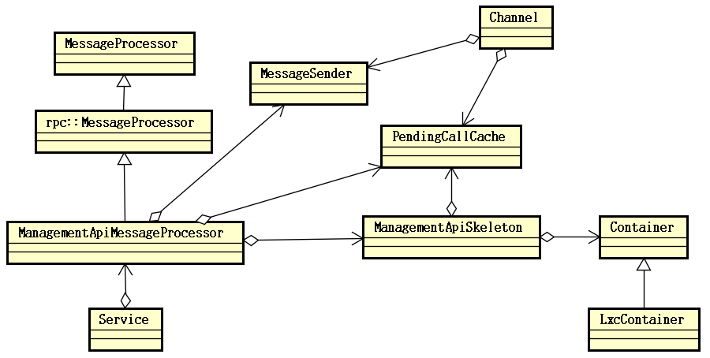
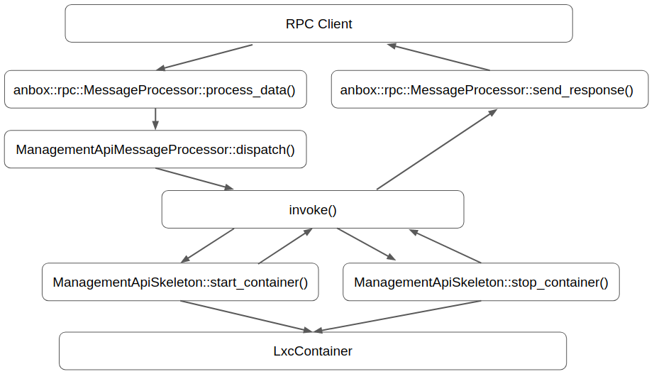
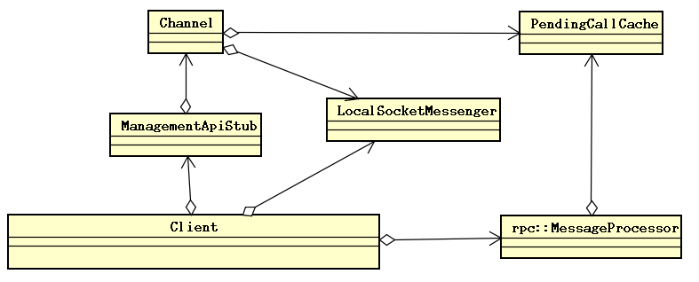
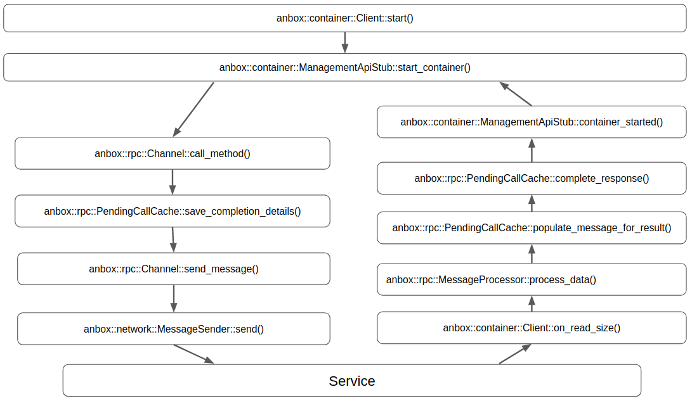
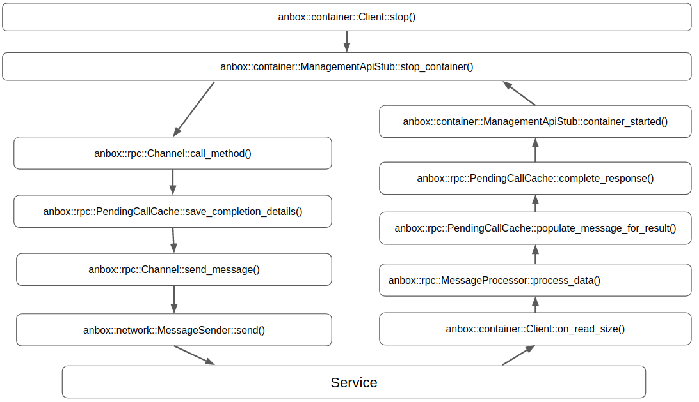

# Anbox 实现分析 3：会话管理器与容器管理器的通信

Anbox 通过一个可执行文件，实现多个不同的应该用逻辑。在启动 Anbox 可执行文件时，通过为它提供不同的命令行参数来确定具体执行哪个命令。Anbox 中这些不同的命令实例之间，整体的通信架构如下图这样：



这些不同的命令实例之间通信的过程大体如下：

- 容器管理器实例首先运行起来，监听在特定位置的 Unix 域 Socket 上；
- 随后会话管理器启动，监听在另外的一些 Unix 域 Socket 上；
- 会话管理器同时连接容器管理器监听的 Unix 域 Socket 上的服务；
- 会话管理器与容器管理器通过 Unix 域 Socket 成功建立连接之后，会话管理器向容器管理器发送命令，请求容器管理器启动 Android 容器；
- 容器管理器收到会话管理器发来的命令后，先给会话管理器一个响应，然后通过 LXC 启动一个 Android 容器，并将会话管理器监听的 Unix 域 Socket 的文件路径映射进 Android 容器的 `/dev/` 目录下；
- Android 容器启动之后，容器内的 Android 进程，通过映射进来的 Unix 域 Socket 与会话管理器建立连接；
- Android 容器启动时，会话管理器与 ADB 守护进程建立连接；
- Anbox 的 install 和 launch 命令主要用于对 Android 容器做一些控制，它们分别用于向 Android 容器中安装应用程序 APK 以及启动容器内的特定 Activity，它们通过 D-Bus 与会话管理器通信。

在 Anbox 中，会话管理器和容器管理器之间是比较重要的一条通信通道。会话管理器和容器管理器之间通过 Unix 域 Socket 进行通信，容器管理器监听在特定位置的 Unix 域 Socket 上，会话管理器发起与容器管理器之间的连接，连接建立之后，两者通过这条连接进行通信。

## 容器管理器接受 RPC 调用

代码层面，在容器管理器一端，通过 `anbox::container::Service` 启动对 Unix 域 Socket 的监听。`anbox::container::Service` 的定义（位于`anbox/src/anbox/container/service.h`）如下：

```
namespace anbox {
namespace container {
class Service : public std::enable_shared_from_this<Service> {
 public:
  static std::shared_ptr<Service> create(const std::shared_ptr<Runtime> &rt, bool privileged);
  ~Service();
 private:
  Service(const std::shared_ptr<Runtime> &rt, bool privileged);
  int next_id();
  void new_client(std::shared_ptr<
                  boost::asio::local::stream_protocol::socket> const &socket);
  std::shared_ptr<common::Dispatcher> dispatcher_;
  std::shared_ptr<network::PublishedSocketConnector> connector_;
  std::atomic<int> next_connection_id_;
  std::shared_ptr<network::Connections<network::SocketConnection>> connections_;
  std::shared_ptr<Container> backend_;
  bool privileged_;
};
}  // namespace container
}  // namespace anbox
```

***`dispatcher_` 看起来没有实际的用处。\*** `anbox::container::Service` 的实现（位于 `anbox/src/anbox/container/service.cpp`）如下：

```
namespace anbox {
namespace container {
std::shared_ptr<Service> Service::create(const std::shared_ptr<Runtime> &rt, bool privileged) {
  auto sp = std::shared_ptr<Service>(new Service(rt, privileged));
  auto wp = std::weak_ptr<Service>(sp);
  auto delegate_connector = std::make_shared<network::DelegateConnectionCreator<boost::asio::local::stream_protocol>>(
      [wp](std::shared_ptr<boost::asio::local::stream_protocol::socket> const &socket) {
        if (auto service = wp.lock())
          service->new_client(socket);
  });
  const auto container_socket_path = SystemConfiguration::instance().container_socket_path();
  sp->connector_ = std::make_shared<network::PublishedSocketConnector>(container_socket_path, rt, delegate_connector);
  // Make sure others can connect to our socket
  ::chmod(container_socket_path.c_str(), S_IRUSR | S_IWUSR | S_IRGRP | S_IWGRP | S_IROTH | S_IWOTH);
  DEBUG("Everything setup. Waiting for incoming connections.");
  return sp;
}
Service::Service(const std::shared_ptr<Runtime> &rt, bool privileged)
    : dispatcher_(anbox::common::create_dispatcher_for_runtime(rt)),
      next_connection_id_(0),
      connections_(std::make_shared<network::Connections<network::SocketConnection>>()),
      privileged_(privileged) {
}
Service::~Service() {
  connections_->clear();
}
int Service::next_id() { return next_connection_id_++; }
void Service::new_client(std::shared_ptr<boost::asio::local::stream_protocol::socket> const
        &socket) {
  if (connections_->size() >= 1) {
    socket->close();
    return;
  }
  auto const messenger = std::make_shared<network::LocalSocketMessenger>(socket);
  DEBUG("Got connection from pid %d", messenger->creds().pid());
  auto pending_calls = std::make_shared<rpc::PendingCallCache>();
  auto rpc_channel = std::make_shared<rpc::Channel>(pending_calls, messenger);
  auto server = std::make_shared<container::ManagementApiSkeleton>(
      pending_calls, std::make_shared<LxcContainer>(privileged_, messenger->creds()));
  auto processor = std::make_shared<container::ManagementApiMessageProcessor>(
      messenger, pending_calls, server);
  auto const &connection = std::make_shared<network::SocketConnection>(
      messenger, messenger, next_id(), connections_, processor);
  connection->set_name("container-service");
  connections_->add(connection);
  connection->read_next_message();
}
}  // namespace container
}  // namespace anbox
```

在 `anbox::container::Service` 的构造函数中，通过 `anbox::network::PublishedSocketConnector` 及 `anbox::network::DelegateConnectionCreator` 等组件，启动对 Unix 域 Socket 的监听。Anbox 中处理 Unix 域 Socket 监听的基本方法/模型，请参考 [Anbox 实现分析 2：I/O 模型](https://www.wolfcstech.com/2018/01/11/anbox_analysis002_io_model/) 一文中的相关部分。

`anbox::container::Service` 通过 `anbox::network::Connections` 和
`anbox::network::SocketConnection` 等管理新接受的连接，它限制只与一个会话管理器实例建立一条连接。`anbox::container::Service` 将处理收到的消息的组件 `anbox::container::ManagementApiMessageProcessor` 与底层的连接粘起来。

Anbox 的容器管理器和会话管理器通过基于 Protobuf 设计的 RPC 进行通信。`anbox::container::Service` 中处理收到的消息及接受 RPC 调用的相关组件的设计框架如下：



***在 Anbox 的设计中，`anbox::rpc::Channel` 及 `anbox::rpc::PendingCallCache` 本来主要用于 RPC 调用发起端的消息收发，但在 `anbox::container::Service::new_client()` 中，同样为新连接创建了这两个类的对象，这显得有点多次一举。\***

`anbox::container::Service` 通过 `anbox::network::SocketConnection` 收到消息之后，首先交给 `anbox::rpc::MessageProcessor` 的 `process_data()` 处理。

`anbox::rpc::MessageProcessor` 的定义（位于 `anbox/src/anbox/rpc/message_processor.h`）如下：

```
class MessageProcessor : public network::MessageProcessor {
 public:
  MessageProcessor(const std::shared_ptr<network::MessageSender>& sender,
                   const std::shared_ptr<PendingCallCache>& pending_calls);
  ~MessageProcessor();
  bool process_data(const std::vector<std::uint8_t>& data) override;
  void send_response(::google::protobuf::uint32 id,
                     google::protobuf::MessageLite* response);
  virtual void dispatch(Invocation const&) {}
  virtual void process_event_sequence(const std::string&) {}
 private:
  std::shared_ptr<network::MessageSender> sender_;
  std::vector<std::uint8_t> buffer_;
  std::shared_ptr<PendingCallCache> pending_calls_;
};
```

`anbox::rpc::MessageProcessor` 的实现（位于 `anbox/src/anbox/rpc/message_processor.cpp`）如下：

```
MessageProcessor::MessageProcessor(
    const std::shared_ptr<network::MessageSender> &sender,
    const std::shared_ptr<PendingCallCache> &pending_calls)
    : sender_(sender), pending_calls_(pending_calls) {}
MessageProcessor::~MessageProcessor() {}
bool MessageProcessor::process_data(const std::vector<std::uint8_t> &data) {
  for (const auto &byte : data) buffer_.push_back(byte);
  while (buffer_.size() > 0) {
    const auto high = buffer_[0];
    const auto low = buffer_[1];
    size_t const message_size = (high << 8) + low;
    const auto message_type = buffer_[2];
    // If we don't have yet all bytes for a new message return and wait
    // until we have all.
    if (buffer_.size() - header_size < message_size) break;
    if (message_type == MessageType::invocation) {
      anbox::protobuf::rpc::Invocation raw_invocation;
      raw_invocation.ParseFromArray(buffer_.data() + header_size, message_size);
      dispatch(Invocation(raw_invocation));
    } else if (message_type == MessageType::response) {
      auto result = make_protobuf_object<protobuf::rpc::Result>();
      result->ParseFromArray(buffer_.data() + header_size, message_size);
      if (result->has_id()) {
        pending_calls_->populate_message_for_result(*result,
                                                    [&](google::protobuf::MessageLite *result_message) {
                                                      result_message->ParseFromString(result->response());
                                                    });
        pending_calls_->complete_response(*result);
      }
      for (int n = 0; n < result->events_size(); n++)
        process_event_sequence(result->events(n));
    }
    buffer_.erase(buffer_.begin(),
                  buffer_.begin() + header_size + message_size);
  }
  return true;
}
void MessageProcessor::send_response(::google::protobuf::uint32 id,
                                     google::protobuf::MessageLite *response) {
  VariableLengthArray<serialization_buffer_size> send_response_buffer(
      static_cast<size_t>(response->ByteSize()));
  response->SerializeWithCachedSizesToArray(send_response_buffer.data());
  anbox::protobuf::rpc::Result send_response_result;
  send_response_result.set_id(id);
  send_response_result.set_response(send_response_buffer.data(),
                                    send_response_buffer.size());
  send_response_buffer.resize(send_response_result.ByteSize());
  send_response_result.SerializeWithCachedSizesToArray(
      send_response_buffer.data());
  const size_t size = send_response_buffer.size();
  const unsigned char header_bytes[header_size] = {
      static_cast<unsigned char>((size >> 8) & 0xff),
      static_cast<unsigned char>((size >> 0) & 0xff), MessageType::response,
  };
  std::vector<std::uint8_t> send_buffer(sizeof(header_bytes) + size);
  std::copy(header_bytes, header_bytes + sizeof(header_bytes),
            send_buffer.begin());
  std::copy(send_response_buffer.data(),
            send_response_buffer.data() + send_response_buffer.size(),
            send_buffer.begin() + sizeof(header_bytes));
  sender_->send(reinterpret_cast<const char *>(send_buffer.data()),
                send_buffer.size());
}
```

在会话管理器与容器管理器之间的 RPC 通信中，`anbox::rpc::MessageProcessor` 是一个同时用于 RPC 调用发起端和接受端的组件。容器管理器作为 RPC 调用的接受端，接收发自于会话管理器的类型为 `MessageType::invocation` 的消息。

会话管理器与容器管理器之间的 RPC 通信的消息格式为：**[3 个字节的消息头]** + **[经由 Protobuf MessageLite 对象序列化得到的消息体]**，其中消息头的前两个字节为 16 位的消息体长度的大尾端表示，第 3 个字节为消息的类型。RPC 消息的具体定义在 `anbox/src/anbox/protobuf/anbox_rpc.proto` 文件中：

```
option optimize_for = LITE_RUNTIME;
package anbox.protobuf.rpc;
message Invocation {
    required uint32 id = 1;
    required string method_name = 2;
    required bytes parameters = 3;
    required uint32 protocol_version = 4;
}
message Result {
    optional uint32 id = 1;
    optional bytes response = 2;
    repeated bytes events = 3;
}
message StructuredError {
  optional uint32 domain = 1;
  optional uint32 code = 2;
}
message Void {
  optional string error = 127;
  optional StructuredError structured_error = 128;
}
```

`Invocation` 消息用于发起 RPC 调用，`Result`、`Void` 和 `StructuredError` 用于返回响应或错误消息。

对于容器管理器而言，`anbox::rpc::MessageProcessor` 在其 `process_data()` 中首先提取消息头，得到消息体的长度和类型，然后提取消息体并反序列化得到 Protobuf 消息 `anbox::protobuf::rpc::Invocation`，随后将该 Protobuf 消息封装为 `anbox::rpc::Invocation` 类的对象，并调用 `dispatch(Invocation const&)` 将消息派发出去。

`anbox::rpc::Invocation` 类的定义（位于 `anbox/src/anbox/rpc/message_processor.h` 中）如下：

```
class Invocation {
 public:
  Invocation(anbox::protobuf::rpc::Invocation const& invocation)
      : invocation_(invocation) {}
  const ::std::string& method_name() const;
  const ::std::string& parameters() const;
  google::protobuf::uint32 id() const;
 private:
  anbox::protobuf::rpc::Invocation const& invocation_;
};
```

`anbox::rpc::Invocation` 类的实现（位于 `anbox/src/anbox/rpc/message_processor.cpp` 中）如下：

```
const ::std::string &Invocation::method_name() const {
  return invocation_.method_name();
}
const ::std::string &Invocation::parameters() const {
  return invocation_.parameters();
}
google::protobuf::uint32 Invocation::id() const { return invocation_.id(); }

```

`anbox::rpc::Invocation` 类只是对 `anbox::protobuf::rpc::Invocation` 的简单包装。

`anbox::rpc::MessageProcessor` 的 `dispatch(Invocation const&)` 是一个虚函数，其实际的实现位于 `ManagementApiMessageProcessor` 中。`anbox::container::ManagementApiMessageProcessor` 的定义（位于 `anbox/src/anbox/container/management_api_message_processor.h` 中）如下：

```
namespace anbox {
namespace container {
class ManagementApiSkeleton;
class ManagementApiMessageProcessor : public rpc::MessageProcessor {
 public:
  ManagementApiMessageProcessor(
      const std::shared_ptr<network::MessageSender> &sender,
      const std::shared_ptr<rpc::PendingCallCache> &pending_calls,
      const std::shared_ptr<ManagementApiSkeleton> &server);
  ~ManagementApiMessageProcessor();
  void dispatch(rpc::Invocation const &invocation) override;
  void process_event_sequence(const std::string &event) override;
 private:
  std::shared_ptr<ManagementApiSkeleton> server_;
};
}  // namespace container
}  // namespace anbox
```

`anbox::container::ManagementApiMessageProcessor` 的实现（位于 `anbox/src/anbox/container/management_api_message_processor.cpp` 中）如下：

```
namespace anbox {
namespace container {
ManagementApiMessageProcessor::ManagementApiMessageProcessor(
    const std::shared_ptr<network::MessageSender> &sender,
    const std::shared_ptr<rpc::PendingCallCache> &pending_calls,
    const std::shared_ptr<ManagementApiSkeleton> &server)
    : rpc::MessageProcessor(sender, pending_calls), server_(server) {}
ManagementApiMessageProcessor::~ManagementApiMessageProcessor() {}
void ManagementApiMessageProcessor::dispatch(rpc::Invocation const &invocation) {
  if (invocation.method_name() == "start_container")
    invoke(this, server_.get(), &ManagementApiSkeleton::start_container, invocation);
  else if (invocation.method_name() == "stop_container")
    invoke(this, server_.get(), &ManagementApiSkeleton::stop_container, invocation);
}
void ManagementApiMessageProcessor::process_event_sequence(
    const std::string &) {}
}  // namespace container
}  // namespace anbox
```

`anbox::container::ManagementApiMessageProcessor` 的实现很简单，只支持两种 RPC 调用，分别为启动 Android 容器和停止 Android 容器，在它的 `dispatch()` 函数中，根据方法名，调用对应的函数。

函数调用通过一个函数模板 `invoke()` 完成，该函数模板定义（位于 `anbox/src/anbox/rpc/template_message_processor.h`）如下：

```
namespace anbox {
namespace rpc {
// Utility metafunction result_ptr_t<> allows invoke() to pick the right
// send_response() overload. The base template resolves to the prototype
// "send_response(::google::protobuf::uint32 id, ::google::protobuf::Message*
// response)"
// Client code may specialize result_ptr_t to resolve to another overload.
template <typename ResultType>
struct result_ptr_t {
  typedef ::google::protobuf::MessageLite* type;
};
// Boiler plate for unpacking a parameter message, invoking a server function,
// and
// sending the result message. Assumes the existence of Self::send_response().
template <class Self, class Bridge, class BridgeX, class ParameterMessage,
          class ResultMessage>
void invoke(Self* self, Bridge* rpc,
            void (BridgeX::*function)(ParameterMessage const* request,
                                      ResultMessage* response,
                                      ::google::protobuf::Closure* done),
            Invocation const& invocation) {
  ParameterMessage parameter_message;
  if (!parameter_message.ParseFromString(invocation.parameters()))
    throw std::runtime_error("Failed to parse message parameters!");
  ResultMessage result_message;
  try {
    std::unique_ptr<google::protobuf::Closure> callback(
        google::protobuf::NewPermanentCallback<
            Self, ::google::protobuf::uint32,
            typename result_ptr_t<ResultMessage>::type>(
            self, &Self::send_response, invocation.id(), &result_message));
    (rpc->*function)(&parameter_message, &result_message, callback.get());
  } catch (std::exception const& x) {
    result_message.set_error(std::string("Error processing request: ") +
                             x.what());
    self->send_response(invocation.id(), &result_message);
  }
}
}  // namespace rpc
}  // namespace anbox
```

直接启动和停止 Android 容器的职责，由 `anbox::container::ManagementApiSkeleton` 完成，这个类的定义（位于 `anbox/src/anbox/container/management_api_skeleton.h`）如下：

```
class Container;
class ManagementApiSkeleton {
 public:
  ManagementApiSkeleton(
      const std::shared_ptr<rpc::PendingCallCache> &pending_calls,
      const std::shared_ptr<Container> &container);
  ~ManagementApiSkeleton();
  void start_container(
      anbox::protobuf::container::StartContainer const *request,
      anbox::protobuf::rpc::Void *response, google::protobuf::Closure *done);
  void stop_container(
      anbox::protobuf::container::StopContainer const *request,
      anbox::protobuf::rpc::Void *response, google::protobuf::Closure *done);
 private:
  std::shared_ptr<rpc::PendingCallCache> pending_calls_;
  std::shared_ptr<Container> container_;
};
```

这个类的定义很简单，其实现（位于 `anbox/src/anbox/container/management_api_skeleton.cpp`）如下：

```
namespace anbox {
namespace container {
ManagementApiSkeleton::ManagementApiSkeleton(
    const std::shared_ptr<rpc::PendingCallCache> &pending_calls,
    const std::shared_ptr<Container> &container)
    : pending_calls_(pending_calls), container_(container) {}
ManagementApiSkeleton::~ManagementApiSkeleton() {}
void ManagementApiSkeleton::start_container(
    anbox::protobuf::container::StartContainer const *request,
    anbox::protobuf::rpc::Void *response, google::protobuf::Closure *done) {
  if (container_->state() == Container::State::running) {
    response->set_error("Container is already running");
    done->Run();
    return;
  }
  Configuration container_configuration;
  const auto configuration = request->configuration();
  for (int n = 0; n < configuration.bind_mounts_size(); n++) {
    const auto bind_mount = configuration.bind_mounts(n);
    container_configuration.bind_mounts.insert(
        {bind_mount.source(), bind_mount.target()});
  }
  try {
    container_->start(container_configuration);
  } catch (std::exception &err) {
    response->set_error(utils::string_format("Failed to start container: %s", err.what()));
  }
  done->Run();
}
void ManagementApiSkeleton::stop_container(
    anbox::protobuf::container::StopContainer const *request,
    anbox::protobuf::rpc::Void *response, google::protobuf::Closure *done) {
  (void)request;
  if (container_->state() != Container::State::running) {
    response->set_error("Container is not running");
    done->Run();
    return;
  }
  try {
    container_->stop();
  } catch (std::exception &err) {
    response->set_error(utils::string_format("Failed to stop container: %s", err.what()));
  }
  done->Run();
}
}  // namespace container
}  // namespace anbox
```

`anbox::container::ManagementApiSkeleton` 通过 `Container` 类启动或停止 Android 容器。配合函数模板 `invoke()` 的定义，及 Protobuf 的相关方法实现，不难理解， `start_container()` 和 `stop_container()` 函数的参数消息，在 `invoke()` 函数中由 `Invocation` 消息的参数字段的字节数组反序列化得到，这两个函数的执行过程，都是向 `response` 参数中填入返回给调用者的响应，并通过 `done->Run()` 将响应通过 `ManagementApiMessageProcessor::send_response()` 函数，即
`anbox::rpc::MessageProcessor::send_response()` 函数发送回调用端。

在 `anbox::rpc::MessageProcessor::send_response()` 函数中，先将响应序列化，然后将序列化之后的响应放进 `anbox::protobuf::rpc::Result` Protobuf 消息中，最后再将 `anbox::protobuf::rpc::Result` 包装为 Anbox 的 RPC 消息发送回调用端。

`anbox::container::ManagementApiSkeleton` 的 `pending_calls_` 似乎也没有实际的用处。

至此整个 RPC 调用接受处理流程结束。整个流程如下图所示：



## 会话管理器发起 RPC 调用

在 Anbox 的会话管理器中，通过 `anbox::container::Client` 发起与容器管理器之间的连接，并处理双方之间的 RPC 通信，这个类的定义（位于 `anbox/src/anbox/container/client.h`）如下：

```
class Client {
 public:
  typedef std::function<void()> TerminateCallback;

  Client(const std::shared_ptr<Runtime> &rt);
  ~Client();

  void start(const Configuration &configuration);
  void stop();

  void register_terminate_handler(const TerminateCallback &callback);

 private:
  void read_next_message();
  void on_read_size(const boost::system::error_code &ec,
                    std::size_t bytes_read);

  std::shared_ptr<network::LocalSocketMessenger> messenger_;
  std::shared_ptr<rpc::PendingCallCache> pending_calls_;
  std::shared_ptr<rpc::Channel> rpc_channel_;
  std::shared_ptr<ManagementApiStub> management_api_;
  std::shared_ptr<rpc::MessageProcessor> processor_;
  std::array<std::uint8_t, 8192> buffer_;
  TerminateCallback terminate_callback_;
};
```

`anbox::container::Client` 主要向外部暴露了两个接口，一是启动容器，二是停止容器，`SessionManager` 通过这两个接口来控制容器的启动与停止。`anbox::container::Client` 类的实现（位于 `anbox/src/anbox/container/client.cpp`）如下：

```
Client::Client(const std::shared_ptr<Runtime> &rt)
    : messenger_(std::make_shared<network::LocalSocketMessenger>(
          SystemConfiguration::instance().container_socket_path(), rt)),
      pending_calls_(std::make_shared<rpc::PendingCallCache>()),
      rpc_channel_(std::make_shared<rpc::Channel>(pending_calls_, messenger_)),
      management_api_(std::make_shared<ManagementApiStub>(rpc_channel_)),
      processor_(
          std::make_shared<rpc::MessageProcessor>(messenger_, pending_calls_)) {
  read_next_message();
}
Client::~Client() {}
void Client::start(const Configuration &configuration) {
  try {
    management_api_->start_container(configuration);
  } catch (const std::exception &e) {
    ERROR("Failed to start container: %s", e.what());
    if (terminate_callback_)
      terminate_callback_();
  }
}
void Client::stop() {
  management_api_->stop_container();
}
void Client::register_terminate_handler(const TerminateCallback &callback) {
  terminate_callback_ = callback;
}
void Client::read_next_message() {
  auto callback = std::bind(&Client::on_read_size, this, std::placeholders::_1,
                            std::placeholders::_2);
  messenger_->async_receive_msg(callback, ba::buffer(buffer_));
}
void Client::on_read_size(const boost::system::error_code &error,
                          std::size_t bytes_read) {
  if (error) {
    if (terminate_callback_)
      terminate_callback_();
    return;
  }
  std::vector<std::uint8_t> data(bytes_read);
  std::copy(buffer_.data(), buffer_.data() + bytes_read, data.data());
  if (processor_->process_data(data)) read_next_message();
}
```

`anbox::container::Client` 类在其构造函数中，即通过 Unix 域 Socket 建立了与容器管理器的连接，它通过 `ManagementApiStub` 发起 RPC 调用。`ManagementApiStub` 是容器管理器与会话管理器间 RPC 进程间通信在 RPC 调用发起端的接口层，它提供了 ***启动 Android 容器\*** 及 ***关闭 Android 容器\*** 这样的抽象。在 `ManagementApiStub` 之下，是容器管理器与会话管理器间 RPC 进程间通信的 RPC 层，即 `anbox::rpc::Channel`，主要用于处理消息的发送。

`anbox::container::Client` 类本身处理连接中原始数据的接收，这里直接用了裸 `SocketMessenger`，而没有再用 `SocketConnection` 封装。`anbox::container::Client` 收到数据之后，会将数据丢给 `anbox::rpc::MessageProcessor` 处理。类型为`anbox::rpc::PendingCallCache` 的 `pending_calls_` 主要用于处理 RPC 的异步调用。在 `anbox::rpc::Channel` 中，消息发送之后，并不会等待响应的接收，而是在 `pending_calls_` 中为 RPC 调用注册一个完成回调。在 `anbox::rpc::MessageProcessor` 中收到响应的消息之后，前面的完成回调被调用，RPC 调用的发起者得到通知。

`anbox::container::Client` 中处理 RPC 调用的发起的相关组件的设计框架如下：



`anbox::container::Client` 直接使用 `anbox::container::ManagementApiStub` 执行 RPC 调用，这个类的定义（位于 `anbox/src/anbox/container/management_api_stub.h`）如下：

```
class ManagementApiStub : public DoNotCopyOrMove {
 public:
  ManagementApiStub(const std::shared_ptr<rpc::Channel> &channel);
  ~ManagementApiStub();
  void start_container(const Configuration &configuration);
  void stop_container();
 private:
  template <typename Response>
  struct Request {
    Request() : response(std::make_shared<Response>()), success(true) {}
    std::shared_ptr<Response> response;
    bool success;
    common::WaitHandle wh;
  };
  void container_started(Request<protobuf::rpc::Void> *request);
  void container_stopped(Request<protobuf::rpc::Void> *request);
  mutable std::mutex mutex_;
  std::shared_ptr<rpc::Channel> channel_;
};
```

`anbox::container::ManagementApiStub` 定义了启动容器和停止容器的接口，并定义了容器启动完成和容器停止完成之后的回调，它还定义了 `Request` 类，用于封装请求的响应，及一个 `WaitHandle`。`WaitHandle` 由 RPC 调用的发起端用于等待请求的结束。

`anbox::container::ManagementApiStub` 类的实现（位于 `anbox/src/anbox/container/management_api_stub.cpp`）如下：

```
ManagementApiStub::ManagementApiStub(
    const std::shared_ptr<rpc::Channel> &channel)
    : channel_(channel) {}
ManagementApiStub::~ManagementApiStub() {}
void ManagementApiStub::start_container(const Configuration &configuration) {
  auto c = std::make_shared<Request<protobuf::rpc::Void>>();
  protobuf::container::StartContainer message;
  auto message_configuration = new protobuf::container::Configuration;
  for (const auto &item : configuration.bind_mounts) {
    auto bind_mount_message = message_configuration->add_bind_mounts();
    bind_mount_message->set_source(item.first);
    bind_mount_message->set_target(item.second);
  }
  message.set_allocated_configuration(message_configuration);
  {
    std::lock_guard<decltype(mutex_)> lock(mutex_);
    c->wh.expect_result();
  }
  channel_->call_method("start_container", &message, c->response.get(),
      google::protobuf::NewCallback(this, &ManagementApiStub::container_started, c.get()));
  c->wh.wait_for_all();
  if (c->response->has_error()) throw std::runtime_error(c->response->error());
}
void ManagementApiStub::container_started(Request<protobuf::rpc::Void> *request) {
  request->wh.result_received();
}
void ManagementApiStub::stop_container() {
  auto c = std::make_shared<Request<protobuf::rpc::Void>>();
  protobuf::container::StopContainer message;
  message.set_force(false);
  {
    std::lock_guard<decltype(mutex_)> lock(mutex_);
    c->wh.expect_result();
  }
  channel_->call_method("stop_container", &message, c->response.get(),
      google::protobuf::NewCallback(this, &ManagementApiStub::container_stopped, c.get()));
  c->wh.wait_for_all();
  if (c->response->has_error()) throw std::runtime_error(c->response->error());
}
void ManagementApiStub::container_stopped(Request<protobuf::rpc::Void> *request) {
  request->wh.result_received();
}
```

尽管实际的 RPC 调用是异步的，但 `anbox::container::ManagementApiStub` 类通过条件变量为其调用者提供了一种同步执行的假象。启动容器和停止容器的行为通过另外的 Protobuf 消息来描述，这些消息的定义（位于 `anbox/src/anbox/protobuf/anbox_container.proto`）如下：

```
package anbox.protobuf.container;
message Configuration {
    message BindMount {
        required string source = 1;
        required string target = 2;
    }
    repeated BindMount bind_mounts = 1;
}
message StartContainer {
    required Configuration configuration = 1;
}
message StopContainer {
    optional bool force = 1;
}
```

在 `ManagementApiStub::start_container()` 和 `ManagementApiStub::stop_container()` 函数中，将参数封装进对应的 Protobuf 消息中，然后更新 `Request` 的 `WaitHandle` 中用于表示期待接收到的响应的状态，随后通过 `anbox::rpc::Channel` 发起 RPC 调用并注册完成回调，最后等待在 `Request` 的 `WaitHandle` 上。

启动容器和停止容器的 RPC 调用完成之后，对应的回调被调用，它们通过相应的请求的 `WaitHandle` 通知调用结束，`ManagementApiStub::start_container()` 和 `ManagementApiStub::stop_container()` 函数返回。

***`ManagementApiStub` 的设计实际上有几处问题。首先是定义的 `mutex_` 成员，看上去毫无意义；其次是等待的方法 `wait_for_all()`，这个函数会一直等待条件成立，如果容器管理器进程意外终止，或者由于其它什么原因，无法给会话管理器发回响应消息，则会话管理器会一直等在那里无法结束，正确的做法应该用有超时的等待，等待一段时间之后，就假设启动容器失败，并退出。\***

可以看一下 `WaitHandle` 的设计与实现。这个类的定义（位于 `anbox/src/anbox/common/wait_handle.h`）如下：

```
namespace anbox {
namespace common {
struct WaitHandle {
 public:
  WaitHandle();
  ~WaitHandle();
  void expect_result();
  void result_received();
  void wait_for_all();
  void wait_for_one();
  void wait_for_pending(std::chrono::milliseconds limit);
  bool has_result();
  bool is_pending();
 private:
  std::mutex guard;
  std::condition_variable wait_condition;
  int expecting;
  int received;
};
}  // namespace common
}  // namespace anbox
```

`WaitHandle` 封装标准库的 `std::mutex` 和 `std::condition_variable` 来构造等待设施。这个类的实现（位于 `anbox/src/anbox/common/wait_handle.cpp`）如下：

```
namespace anbox {
namespace common {
WaitHandle::WaitHandle()
    : guard(), wait_condition(), expecting(0), received(0) {}
WaitHandle::~WaitHandle() {}
void WaitHandle::expect_result() {
  std::lock_guard<std::mutex> lock(guard);
  expecting++;
}
void WaitHandle::result_received() {
  std::lock_guard<std::mutex> lock(guard);
  received++;
  wait_condition.notify_all();
}
void WaitHandle::wait_for_all()  // wait for all results you expect
{
  std::unique_lock<std::mutex> lock(guard);
  wait_condition.wait(lock, [&] { return received == expecting; });
  received = 0;
  expecting = 0;
}
void WaitHandle::wait_for_pending(std::chrono::milliseconds limit) {
  std::unique_lock<std::mutex> lock(guard);
  wait_condition.wait_for(lock, limit, [&] { return received == expecting; });
}
void WaitHandle::wait_for_one()  // wait for any single result
{
  std::unique_lock<std::mutex> lock(guard);
  wait_condition.wait(lock, [&] { return received != 0; });
  --received;
  --expecting;
}
bool WaitHandle::has_result() {
  std::lock_guard<std::mutex> lock(guard);
  return received > 0;
}
bool WaitHandle::is_pending() {
  std::unique_lock<std::mutex> lock(guard);
  return expecting > 0 && received != expecting;
}
}  // namespace common
}  // namespace anbox
```

需要等待的一端，通过调用 `expect_result()` 来告诉 `WaitHandle`，需要等待多接收一个响应，并通过 `wait_for_all()`、`wait_for_pending()` 和 `wait_for_one()` 来等待结果的出现。处理收到的消息的线程，通过 `result_received()` 通知等待的线程。

`anbox::rpc::PendingCallCache` 是一个容器，用于保存已经发送了请求消息，已经发起但还没有得到响应的 RPC 调用的描述及完成回调，这个类的定义（位于 `anbox/src/anbox/rpc/pending_call_cache.h`）如下：

```
class PendingCallCache {
 public:
  PendingCallCache();
  void save_completion_details(
      anbox::protobuf::rpc::Invocation const &invocation,
      google::protobuf::MessageLite *response,
      google::protobuf::Closure *complete);
  void populate_message_for_result(
      anbox::protobuf::rpc::Result &result,
      std::function<void(google::protobuf::MessageLite *)> const &populator);
  void complete_response(anbox::protobuf::rpc::Result &result);
  void force_completion();
  bool empty() const;
 private:
  struct PendingCall {
    PendingCall(google::protobuf::MessageLite *response,
                google::protobuf::Closure *target)
        : response(response), complete(target) {}
    PendingCall() : response(0), complete() {}
    google::protobuf::MessageLite *response;
    google::protobuf::Closure *complete;
  };
  std::mutex mutable mutex_;
  std::map<int, PendingCall> pending_calls_;
};
}  // namespace rpc
}  // namespace anbox
```

`anbox::rpc::PendingCallCache` 类还定义一个 `PendingCall` 用于封装请求的响应对象及完成回调，它用一个 map 保存 `PendingCall`，由于需要在 `anbox::rpc::MessageProcessor::process_data()` 和 `anbox::rpc::Channel` 的线程中访问，为了线程安全计，每次访问都有锁进行保护。

`anbox::rpc::PendingCallCache` 类的实现（位于 `anbox/src/anbox/rpc/pending_call_cache.cpp`）如下：

```
namespace anbox {
namespace rpc {
PendingCallCache::PendingCallCache() {}
void PendingCallCache::save_completion_details(
    anbox::protobuf::rpc::Invocation const& invocation,
    google::protobuf::MessageLite* response,
    google::protobuf::Closure* complete) {
  std::unique_lock<std::mutex> lock(mutex_);
  pending_calls_[invocation.id()] = PendingCall(response, complete);
}
void PendingCallCache::populate_message_for_result(
    anbox::protobuf::rpc::Result& result,
    std::function<void(google::protobuf::MessageLite*)> const& populator) {
  std::unique_lock<std::mutex> lock(mutex_);
  populator(pending_calls_.at(result.id()).response);
}
void PendingCallCache::complete_response(anbox::protobuf::rpc::Result& result) {
  PendingCall completion;
  {
    std::unique_lock<std::mutex> lock(mutex_);
    auto call = pending_calls_.find(result.id());
    if (call != pending_calls_.end()) {
      completion = call->second;
      pending_calls_.erase(call);
    }
  }
  if (completion.complete) completion.complete->Run();
}
void PendingCallCache::force_completion() {
  std::unique_lock<std::mutex> lock(mutex_);
  for (auto& call : pending_calls_) {
    auto& completion = call.second;
    completion.complete->Run();
  }
  pending_calls_.erase(pending_calls_.begin(), pending_calls_.end());
}
bool PendingCallCache::empty() const {
  std::unique_lock<std::mutex> lock(mutex_);
  return pending_calls_.empty();
}
}  // namespace rpc
}  // namespace anbox
```

`save_completion_details()` 用于向 `anbox::rpc::PendingCallCache` 中放入调用，`populate_message_for_result()` 用于把返回的响应消息塞给调用，`complete_response()` 则用于通知结果的返回，调用对应的完成回调。

`anbox::rpc::Channel` 用于序列化消息，并发送出去，其定义（位于 `anbox/src/anbox/rpc/channel.h`）如下：

```
class Channel {
 public:
  Channel(const std::shared_ptr<PendingCallCache> &pending_calls,
          const std::shared_ptr<network::MessageSender> &sender);
  ~Channel();
  void call_method(std::string const &method_name,
                   google::protobuf::MessageLite const *parameters,
                   google::protobuf::MessageLite *response,
                   google::protobuf::Closure *complete);
  void send_event(google::protobuf::MessageLite const &event);
 private:
  protobuf::rpc::Invocation invocation_for(
      std::string const &method_name,
      google::protobuf::MessageLite const *request);
  void send_message(const std::uint8_t &type,
                    google::protobuf::MessageLite const &message);
  std::uint32_t next_id();
  void notify_disconnected();
  std::shared_ptr<PendingCallCache> pending_calls_;
  std::shared_ptr<network::MessageSender> sender_;
  std::mutex write_mutex_;
};
```

`anbox::rpc::Channel` 负责为每个调用消息分配 ID。`anbox::rpc::Channel` 实现（位于 `anbox/src/anbox/rpc/channel.cpp`）如下：

```
namespace anbox {
namespace rpc {
Channel::Channel(const std::shared_ptr<PendingCallCache> &pending_calls,
                 const std::shared_ptr<network::MessageSender> &sender)
    : pending_calls_(pending_calls), sender_(sender) {}
Channel::~Channel() {}
void Channel::call_method(std::string const &method_name,
                          google::protobuf::MessageLite const *parameters,
                          google::protobuf::MessageLite *response,
                          google::protobuf::Closure *complete) {
  auto const &invocation = invocation_for(method_name, parameters);
  pending_calls_->save_completion_details(invocation, response, complete);
  send_message(MessageType::invocation, invocation);
}
void Channel::send_event(google::protobuf::MessageLite const &event) {
  VariableLengthArray<2048> buffer{static_cast<size_t>(event.ByteSize())};
  event.SerializeWithCachedSizesToArray(buffer.data());
  anbox::protobuf::rpc::Result response;
  response.add_events(buffer.data(), buffer.size());
  send_message(MessageType::response, response);
}
protobuf::rpc::Invocation Channel::invocation_for(
    std::string const &method_name,
    google::protobuf::MessageLite const *request) {
  anbox::VariableLengthArray<2048> buffer{
      static_cast<size_t>(request->ByteSize())};
  request->SerializeWithCachedSizesToArray(buffer.data());
  anbox::protobuf::rpc::Invocation invoke;
  invoke.set_id(next_id());
  invoke.set_method_name(method_name);
  invoke.set_parameters(buffer.data(), buffer.size());
  invoke.set_protocol_version(1);
  return invoke;
}
void Channel::send_message(const std::uint8_t &type,
                           google::protobuf::MessageLite const &message) {
  const size_t size = message.ByteSize();
  const unsigned char header_bytes[header_size] = {
      static_cast<unsigned char>((size >> 8) & 0xff),
      static_cast<unsigned char>((size >> 0) & 0xff), type,
  };
  std::vector<std::uint8_t> send_buffer(sizeof(header_bytes) + size);
  std::copy(header_bytes, header_bytes + sizeof(header_bytes),
            send_buffer.begin());
  message.SerializeToArray(send_buffer.data() + sizeof(header_bytes), size);
  try {
    std::lock_guard<std::mutex> lock(write_mutex_);
    sender_->send(reinterpret_cast<const char *>(send_buffer.data()),
                  send_buffer.size());
  } catch (std::runtime_error const &) {
    notify_disconnected();
    throw;
  }
}
void Channel::notify_disconnected() { pending_calls_->force_completion(); }
std::uint32_t Channel::next_id() {
  static std::uint32_t next_message_id = 0;
  return next_message_id++;
}
}  // namespace rpc
}  // namespace anbox
```

`call_method()` 用于发起 RPC 调用，这个函数将 RPC 调用描述及完成回调保存进 `pending_calls_` 中，随后发送消息。`anbox::rpc::Channel` 主要在操作 Protobuf 消息的序列化，此处不再赘述。

可以再看一下 RPC 调用发起端收到响应消息时的处理，主要是 `anbox::rpc::MessageProcessor` 的下面这一段（位于 `anbox/src/anbox/rpc/message_processor.cpp`）：

```
 } else if (message_type == MessageType::response) {
    auto result = make_protobuf_object<protobuf::rpc::Result>();
    result->ParseFromArray(buffer_.data() + header_size, message_size);
    if (result->has_id()) {
      pending_calls_->populate_message_for_result(*result,
                                                  [&](google::protobuf::MessageLite *result_message) {
                                                    result_message->ParseFromString(result->response());
                                                  });
      pending_calls_->complete_response(*result);
    }
    for (int n = 0; n < result->events_size(); n++)
      process_event_sequence(result->events(n));
  }
  buffer_.erase(buffer_.begin(),
                buffer_.begin() + header_size + message_size);
}
```

这段代码将响应消息塞给 `pending_calls_` 中保存的对应的 `Invocation`，并调用完成回调。

Anbox 中会话管理器与容器管理器通过两个 RPC 调用进行通信，在调用发起端的整个处理过程如下图：



