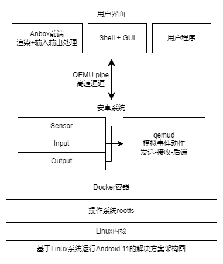

## 2.2 项目的主要工作

图6 Bitcomet解决方案架构图

该种方案从结构上来说适合其他类似移植方案的参考，例如移植其他系统到Linux中时，其图形与输入输出部分的实现可参考本方案的思路。本方案的主要工作如下：

​      此项目基于原有Anbox方案进行**更新及改进**。我们**改进**使用基于Docker容器技术提供隔离的、与Linux并行运行的安卓环境，此种改进是对于原有LXC容器的**平替**，但其重新适配与调试仍然需要大量移植与测试的工作量才能保证其维持原有稳定性，并更好地利用更多的新特性开发新的功能。除此之外我们**更新**了原有Android 7，移植新的Android 11，此过程需要重新移植适配原有Anbox的各个组件适配新安卓上的HIDL接口，同时需要修改安卓底层让其能正常运行在Docker上，此过程仍需要大量的移植于测试的工作量。此项目仍然利用Anbox已实现好并趋于完善的部分功能，在Linux下上层APP实现与安卓底层对接输入输出和OpenGL ES的渲染等实现。这些设计目标在于使用Docker**替代**原有Anbox使用的较旧的LXC容器技术，并**更新**其Android 7到Android 11，其中技术革新点如下：

1. 使用更新的Android 11替代原有老旧的**Android 7**。
2. Android 11中的HAL层使用了HIDL接口这一新的**Treble**的架构，更加规范及更高的可移植性。
3. 使用生态丰富、快速部署、可移植、更加可控的**Docker**作为底层容器运行环境替代原有集成LXC这一高耦合、低可移植性的实现方式。
4. 活用**成熟**的Anbox部分对多平台高兼容性的实现方式，以应对目前国产系统多种硬件平台和系统环境的问题。

## 3. Bitcomet方案测试

在基于现在设计需要的前提下，我们设计了系统功能测试，系统功能测试是验证Bitcomet在Linux下容器启动方案的重要部分。主要是验证其基本功能使用和应用程序的运行情况。系统功能测试主要分为三个测试内容：

1. 基础信息测试，测试其是否能够显示设定的设备名称与型号；

2. 基础功能测试，测试其是否能修改系统默认语言；

3. 基础应用测试，测试其通信录，闹钟，浏览器等系统自带应用以及第三方应用是否能够正常使用：

**具体测试测试过程与结果见“系统基础功能测试与性能分析”文档**
